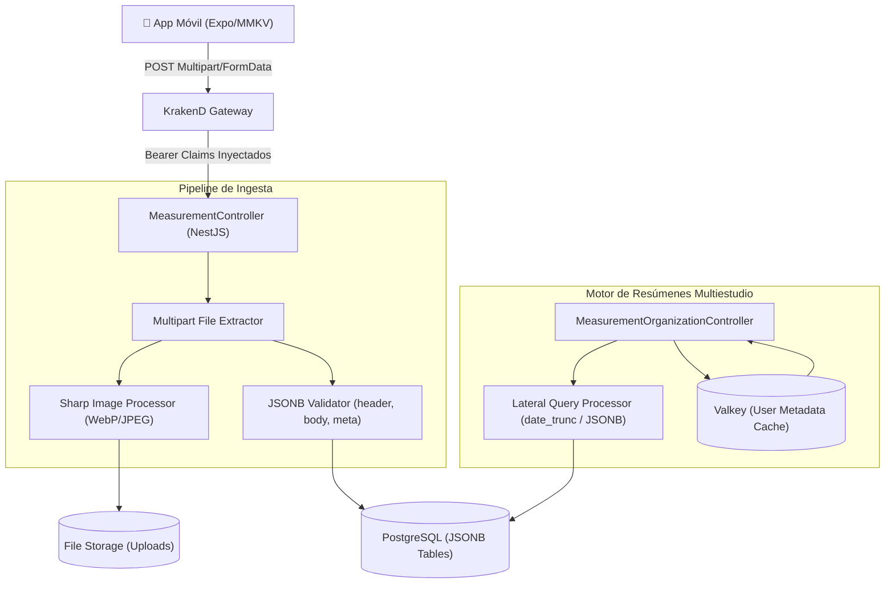

# Arquitectura Técnica — service-measurement

## 1. Visión General del Servicio
`service-measurement` centraliza la ingesta transaccional, el almacenamiento de evidencias multimedia y el motor analítico de CityData v2.

---

## 2. Pipeline de Procesamiento de Fotografías (Sharp)

Cuando se suben fotos desde el campo (`field_photo_1`, etc.):
1. El middleware `FileInterceptor` recibe los buffers en memoria o almacenamiento temporal.
2. `Sharp` realiza:
   - Corrección de orientación EXIF automática (`autoRotate`).
   - Redimensión a límites estándar (máx. 1920x1080 px).
   - Compresión WebP / JPEG con calidad adaptativa (85%).
3. Se almacena en la estructura jerárquica:
   `uploads/{organizationId}/{researchId}/{campaignId}/{measurementId}/{filename}`.

---

## 3. Manejo de Caché de Usuarios con Valkey

Para evitar llamadas externas repetitivas en cada fila de reporte:
- Se consulta la llave `user:profile:{userId}` en Valkey.
- La información de nombre, apellido y correo del encuestador se devuelve de forma atómica.
