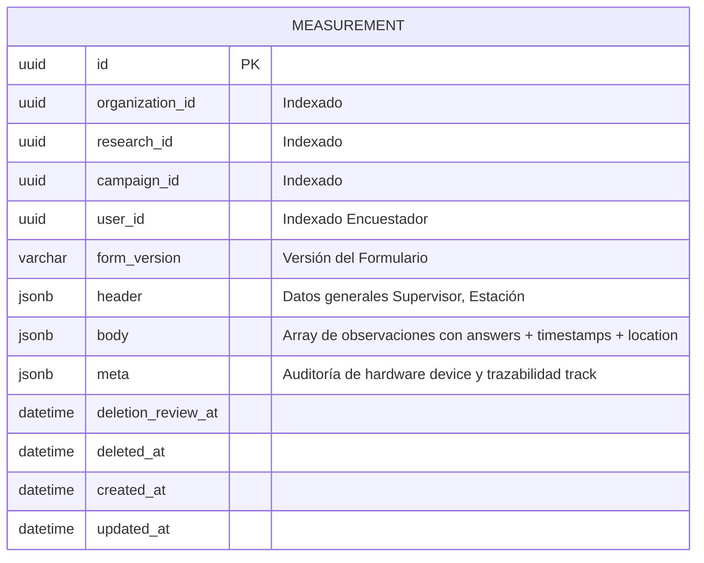

# Base de Datos y Modelo Físico — service-measurement

## 1. Diagrama Entidad-Relación (ERD)



---

## 2. Índices de PostgreSQL y Optimización de Consultas

| Nombre del Índice | Columnas Indexadas | Tipo / Propósito |
| :--- | :--- | :--- |
| `measurement_organization_id_idx` | `organization_id` | Filtro principal multi-tenant |
| `measurement_research_id_idx` | `research_id` | Búsqueda y resúmenes por estudio |
| `measurement_campaign_id_idx` | `campaign_id` | Listado y exportación de campañas |
| `measurement_user_id_idx` | `user_id` | Auditoría de encuestadores y cálculo de productividad |
| `measurement_org_camp_del_idx` | `(organization_id, campaign_id, deleted_at)` | Búsqueda compuesta de mediciones activas |
| `measurement_camp_user_idx` | `(campaign_id, user_id)` | Filtro combinado en dashboard |

---

## 3. Estructura Interna del Campo `body` (JSONB)

```json
[
  {
    "id": "c7a8b9e1-2f34-4b90-9c12-887766554433",
    "answers": {
      "tipo_transporte": "bicicleta",
      "casco_seguridad": true,
      "foto_evidencia": "img_1787590000_abc.jpeg"
    },
    "meta": {
      "timestamps": {
        "manual": null,
        "server": "2026-08-24T14:40:00.000Z",
        "gps": "2026-08-24T14:39:58.210Z",
        "device": "2026-08-24T14:40:01.000Z",
        "resolved": "gps"
      },
      "location": {
        "latitude": 4.609712,
        "longitude": -74.081754,
        "accuracy": 4.5,
        "address": "Cra 7 # 32-10"
      }
    },
    "createdAt": "2026-08-24T14:40:01.000Z"
  }
]
```

---

## 4. Consulta de Agregación Lateral para Resúmenes Multiestudio

Para generar los resúmenes agrupados por Día, Mes o Usuario a través de múltiples estudios en una sola pasada de base de datos:

```sql
SELECT 
    m.research_id AS "researchId",
    m.campaign_id AS "campaignId",
    to_char(date_trunc('day', (elem.value #>> array['meta', 'timestamps', elem.value->'meta'->'timestamps'->>'resolved'])::timestamptz AT TIME ZONE 'America/Bogota'), 'YYYY-MM-DD') AS "groupKey",
    COUNT(*)::int AS count
FROM measurement m
CROSS JOIN LATERAL jsonb_array_elements(m.body) AS elem
WHERE m.organization_id = $1
  AND m.research_id = ANY($2)
  AND m.deleted_at IS NULL
GROUP BY m.research_id, m.campaign_id, "groupKey"
ORDER BY m.research_id, m.campaign_id, "groupKey";
```
