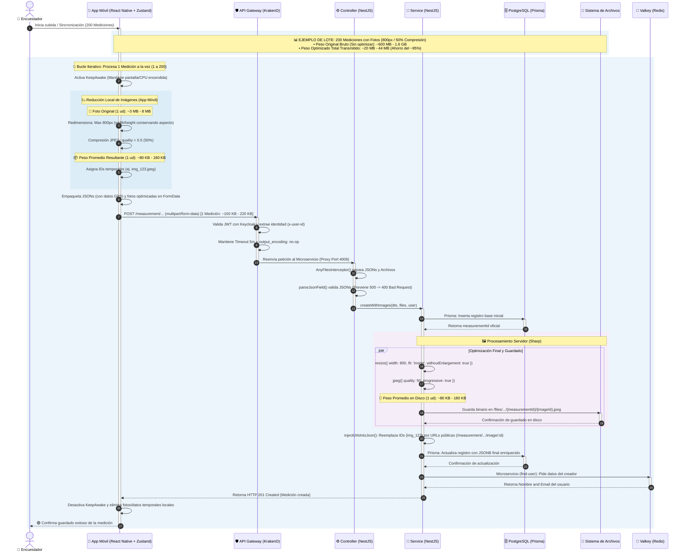

``` mermaid
sequenceDiagram
    autonumber
    actor U as 👤 Encuestador
    participant APP as 📱 App Móvil (React Native + Zustand)
    participant GW as 🛡️ API Gateway (KrakenD)
    participant CTRL as ⚙️ Controller (NestJS)
    participant SVC as 🧠 Service (NestJS)
    participant DB as 🗄️ PostgreSQL (Prisma)
    participant FS as 📁 Sistema de Archivos
    participant VK as 👥 Valkey (Redis)

    U->>APP: Inicia subida / Sincronización (200 Mediciones)
    activate APP
    
    rect rgb(235, 245, 251)
        note over APP, FS: 📊 EJEMPLO DE LOTE: 200 Mediciones con Fotos (800px / 50% Compresión)<br/>• Peso Original Bruto (Sin optimizar): ~600 MB - 1.6 GB<br/>• Peso Optimizado Total Transmitido: ~20 MB - 44 MB (Ahorro del ~95%)
    end

    rect rgb(235, 245, 251)
        note over APP: 🔁 Bucle Iterativo: Procesa 1 Medición a la vez (1 a 200)
        APP->>APP: Activa KeepAwake (Mantiene pantalla/CPU encendida)
        
        rect rgb(220, 237, 248)
            note over APP: 📉 Reducción Local de Imágenes (App Móvil)
            note over APP: 📸 Foto Original (1 ud): ~3 MB - 8 MB
            APP->>APP: Redimensiona: Max 800px (width/height conservando aspecto)
            APP->>APP: Compresión JPEG: quality = 0.5 (50%)
            note over APP: 📦 Peso Promedio Resultante (1 ud): ~80 KB - 180 KB
            APP->>APP: Asigna IDs temporales (ej. img_123.jpeg)
        end
        
        APP->>APP: Empaqueta JSONs (con datos GPS) y fotos optimizadas en FormData
        
        %% Envío HTTP por medición
        APP->>GW: POST /measurement/... (multipart/form-data) [1 Medición: ~100 KB - 220 KB]
        activate GW
        GW->>GW: Valida JWT con Keycloak y extrae identidad (x-user-id)
        GW->>GW: Mantiene Timeout 5m + output_encoding: no-op
        
        GW->>CTRL: Reenvía petición al Microservicio (Proxy Port 4006)
        deactivate GW
        activate CTRL
        
        CTRL->>CTRL: AnyFilesInterceptor() separa JSONs y Archivos
        CTRL->>CTRL: parseJsonField() valida JSONs (Previene 500 -> 400 Bad Request)
        
        CTRL->>SVC: createWithImages(dto, files, user)
        deactivate CTRL
        activate SVC
        
        SVC->>DB: Prisma: Inserta registro base inicial
        activate DB
        DB-->>SVC: Retorna measurementId oficial
        deactivate DB
        
        rect rgb(245, 238, 248)
            note over SVC, FS: 🖼️ Procesamiento Servidor (Sharp)
            par Optimización Final y Guardado
                SVC->>SVC: resize({ width: 800, fit: 'inside', withoutEnlargement: true })
                SVC->>SVC: jpeg({ quality: 50, progressive: true })
                note over SVC: 💾 Peso Promedio en Disco (1 ud): ~80 KB - 180 KB
                SVC->>FS: Guarda binario en /files/.../{measurementId}/{imageId}.jpeg
                activate FS
                FS-->>SVC: Confirmación de guardado en disco
                deactivate FS
            end
        end
        
        SVC->>SVC: injectUrlsIntoJson(): Reemplaza IDs (img_123) por URLs públicas (/measurement/.../image/:id)
        
        SVC->>DB: Prisma: Actualiza registro con JSONB final enriquecido
        activate DB
        DB-->>SVC: Confirmación de actualización
        deactivate DB
        
        SVC->>VK: Microservicio (find-user): Pide datos del creador
        activate VK
        VK-->>SVC: Retorna Nombre and Email del usuario
        deactivate VK
        
        SVC-->>APP: Retorna HTTP 201 Created (Medición creada)
        deactivate SVC
        
        APP->>APP: Desactiva KeepAwake y elimina fotos/datos temporales locales
        APP-->>U: 🟢 Confirma guardado exitoso de la medición
    end
    deactivate APP
```
